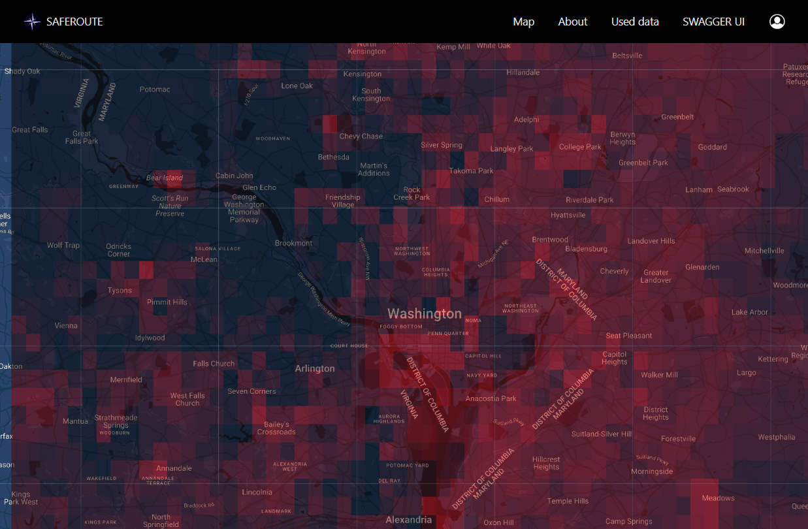
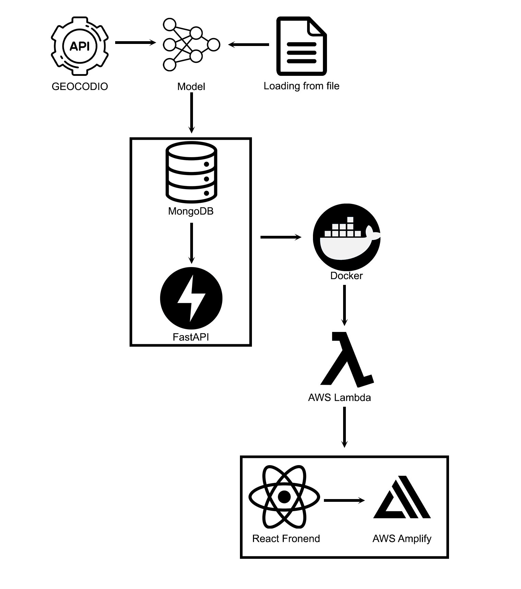

# [SafeRoute](https://main.d3d4kky5khtwtb.amplifyapp.com) 

NOTE: currently googleMapsAPI on deploy is diabled, due to trial period ending. Contact me, to reactivate it, if needed. The heatmaps still work, but design is currently gone  
login: qwerty, password: qwerty12 
SafeRoute overlays a map with a danger level heatmap based on crime data.  
The application is built using FastAPI/MongoDB on the backend and React on frontend. API runs in Docker, deployed on AWS Lambda, and main app is deployed on AWS Amplify. 
 
## Installation

To deploy project you will need to:

    1. Clone the SafeRoute repository to your local machine.
    2. Change uri in mongo_db file.
    3. Build and deploy lambda_func container to AWS Lambda.
    4. Via amplfy init connect frontend to your account.
    5. Deploy frontend to AWS amplify.
    6. Add to env variables MongoDB Atlas MONGODB_URI_PSW and GoogleMapsApi key.
    
To update map:

    1. Install requirements in requirements.txt
    2. Change uri in mongo_db.py file.
    3. Add .env variables (MONGODB_URI_PSW, GEOCODE_API_KEY Geocodio key))
    4. Change settings in mongo_db.py and start it.

## Project strucure
 
The backend precomputes map data, and writes it to the MongoDB. This data can then be retrieved by FastAPI, and, through AWS Lambda, be sent to the frontend, where it will be displayed on map, via GoogleMapsAPI.

## Stack
* [Python](https://www.python.org/) - simple and readable programming language, widely used in web development.
* [FastAPI](https://fastapi.tiangolo.com/) - modern, fast (high-performance) web framework for building APIs with Python, based on standard Python type hints.
* [TensorFlow](https://www.tensorflow.org/) - open-source machine learning framework for building and deploying ML models.
* [AWS Amplify](https://aws.amazon.com/amplify/) - development platform provided by Amazon Web Services (AWS) that enables frontend web and mobile developers to build full-stack applications.
* [AWS Lambda](https://aws.amazon.com/lambda/) - serverless computing service provided by AWS that lets you run your code without provisioning or managing servers.
* [MongoDB Atlas](https://www.mongodb.com/cloud/atlas) - fully managed cloud database service for MongoDB.
* [Docker](https://www.docker.com/) - platform that allows automatic the deployment of applications inside containers, providing an efficient and consistent environment for running applications.
* [React](https://reactjs.org/) - JavaScript library for building user interfaces.

## Decomposition of tasks
### ML
* ✅ Collect income, population and crime data for model
* ✅ Train model
* ✅ Enable model to work on new data
* ✅/🔳 Find reliable datasource to fill the whole map

### Frontend
* ✅ Map
* ✅ Heatmap
* ✅ User registration and login
* ✅ User profile
* 🔳 Landing page

### DB
* ✅ Create Database
* ✅ Connect Database
* ✅ Create in-app interface to interact with DB

### API
* ✅ Data request API

### Authorization
* ✅ Create Login page
* ✅ Connect login page to AWS
* ✅ Connect login page to Google auth

### Algorithm
* ✅ Neural Network
* ✅ Clustering
* ✅ Data export to API

### Loggs
* ✅ Add logs for API

### Tests
* ✅/🔳 testing algorithm
* ✅ Postman

### AWS
* ✅ Deploy the project
* ✅ Deploy the API

### Git
* ✅ Add README on GIT

## Contacts:
* [Telegram](https://t.me/rovikido) 
* Email: oleksandr.zakala@gmail.com
